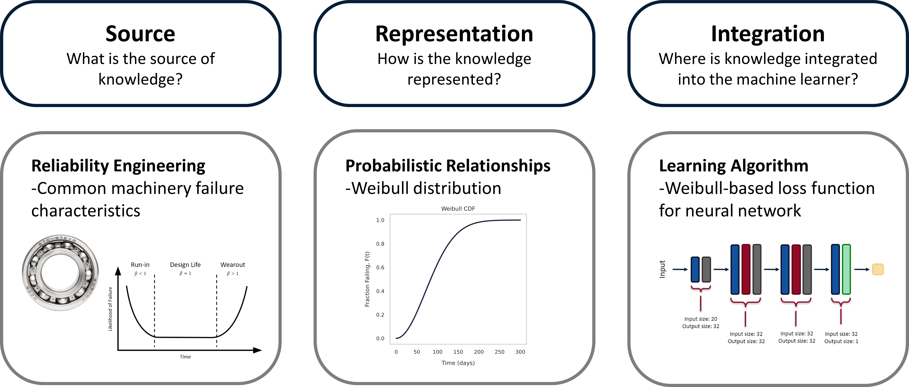
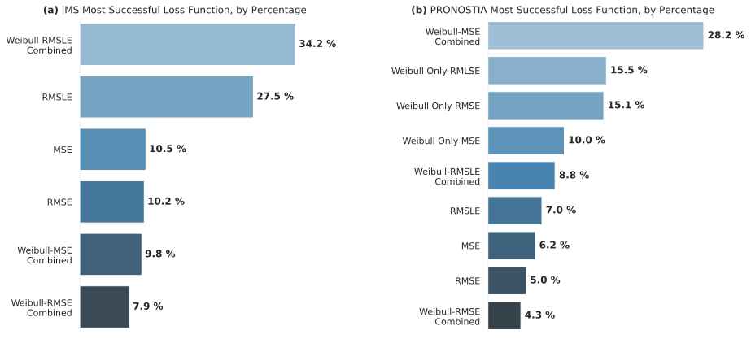
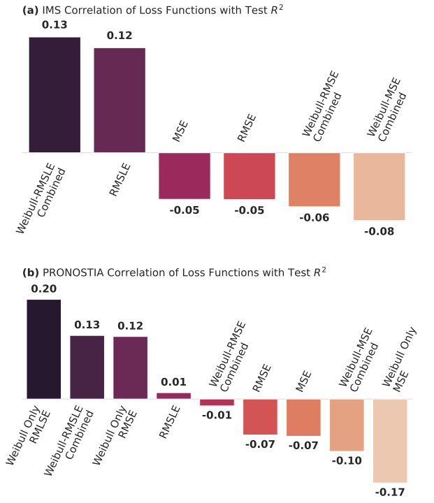
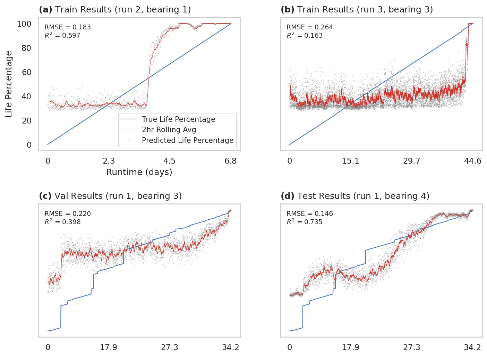
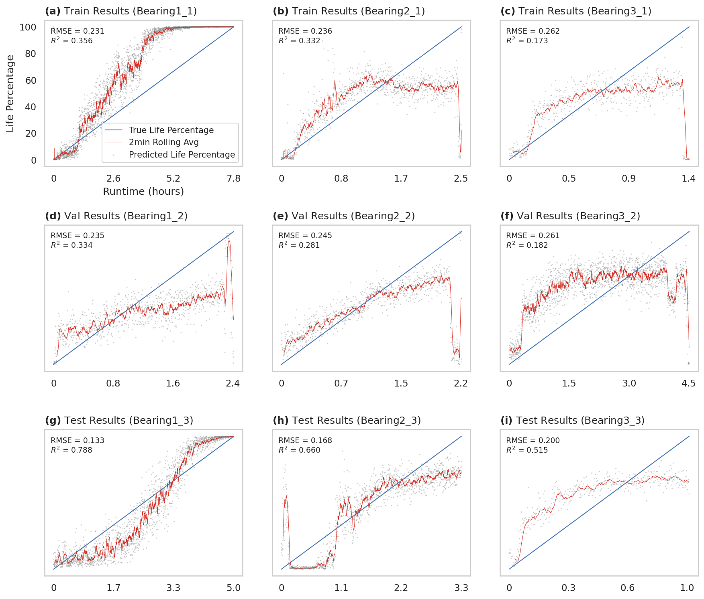

Knowledge Informed Machine Learning using a Weibull-based Loss Function
==============================

> Exploring the concept of knowledge informed machine learning with the use of a Weibull-based loss function. Used to predict remaining useful life (RUL) on the [IMS](https://ti.arc.nasa.gov/tech/dash/groups/pcoe/prognostic-data-repository/#bearing) and [PRONOSTIA](https://ti.arc.nasa.gov/tech/dash/groups/pcoe/prognostic-data-repository/#femto) (also called FEMTO) bearing data sets.

[](https://colab.research.google.com/github/tvhahn/weibull-knowledge-informed-ml/blob/master/notebooks/example.ipynb)
[](https://github.com/tvhahn/weibull-knowledge-informed-ml/blob/master/src/models/model.py) [](https://arxiv.org/abs/2201.01769)

Knowledge informed machine learning is used on the IMS and PRONOSTIA bearing data sets for remaining useful life (RUL) prediction. The knowledge is integrated into a neural network through a novel Weibull-based loss function. A thorough statistical analysis of the Weibull-based loss function is conducted, demonstrating the effectiveness of the method on the PRONOSTIA data set. However, the Weibull-based loss function is less effective on the IMS data set. 

The experiment is detailed in the [Journal of Prognostics and Health Management](https://ojs.library.carleton.ca/index.php/jphm/article/view/3162), with an extensive discussion on the results, shortcomings, and benefits analysis. The paper also gives an overview of knowledge informed machine learning as it applies to prognostics and health management (PHM).

You can reproduce the work, and all figures, by following the instructions in the [Setup](#setup) section. **Even easier**: run the [Colab notebook](https://colab.research.google.com/github/tvhahn/weibull-knowledge-informed-ml/blob/master/notebooks/example.ipynb)!

If you have any questions, leave a comment in the discussion, or email me (18tcvh@queensu.ca).

Feel free to cite my research if you find it useful. Thanks!
```
@article{von2022knowledge,
  title={Knowledge Informed Machine Learning using a Weibull-based Loss Function},
  author={von Hahn, Tim and Mechefske, Chris K},
  journal={Journal of Prognostics and Health Management},
  volume={2},
  number={1},
  pages={9--44},
  year={2022}
}
```

## Summary

In this work, we use the definition of knowledge informed machine learning from von Rueden et al. (their excellent paper is [here](https://arxiv.org/abs/1903.12394)). Here's the general taxonomy of our knowledge informed machine learning experiment:



Bearing vibration data (from the frequency domain) was used as input to feed-forward neural networks. The below figure demonstrates the data as a spectrogram (a) and the spectrogram after "binning" (b). The binned data was used as input.

<div style="text-align: left; ">
<figure>
  
</figure>
</div>


A large hyper-parameter search was conducted on neural networks. Nine different Weibull-based loss functions were tested on each unique network. 

The below chart is a qualitative method of showing the effectiveness of the Weibull-based loss functions on the two data sets.

<div style="text-align: left; ">
<figure>
  
</figure>
</div>


We also conducted a statistical analysis of the results,  as shown below.

<div style="text-align: left; ">
<figure>
  
</figure>
</div>

The top performing models' RUL trends are shown below, for both the IMS and PRONOSTIA data sets.

<div style="text-align: left; ">
<figure>
  
</figure>
</div>


<div style="text-align: left; ">
<figure>
  
</figure>
</div>


## Setup

Tested in linux (MacOS should also work). If you run windows you'll have to do much of the environment setup and data download/preprocessing manually.

To reproduce results:

1. Clone this repo - `clone https://github.com/tvhahn/weibull-knowledge-informed-ml.git`

2. Create virtual environment. Assumes that Conda is installed.
   * Linux/MacOS: use command from the Makefile in the root directory - `make create_environment`
   * Windows: from root directory - `conda env create -f envweibull.yml`
   * HPC: `make create_environment` will detect HPC environment and automatically create environment from `make_hpc_venv.sh`. Tested on Compute Canada. Modify `make_hpc_venv.sh` for your own HPC cluster.

3. Download raw data. The data is from [NASA's Prognostics Center of Excellence Data Set Repository](https://www.nasa.gov/content/prognostics-center-of-excellence-data-set-repository) (which has been recently updated).
   * Linux/MacOS: use `make download`. Will automatically download to appropriate `data/raw` directory. Downloads from Google Drive (since the NASA link wasn't working for sometime).
   * Windows: Manually download the the [IMS](https://phm-datasets.s3.amazonaws.com/NASA/4.+Bearings.zip) and [PRONOSTIA](https://phm-datasets.s3.amazonaws.com/NASA/10.+FEMTO+Bearing.zip) (FEMTO) data sets from NASA prognostics data repository. Put in `data/raw` folder and extract. Put the `IMS.7z` into the `data/raw/IMS` folder and the `FEMTOBearingDataSet.zip` into the `data/raw/FEMTO` folder.
   * HPC: use `make download`. Will automatically detect HPC environment.

4. Extract raw data.
   * Linux/MacOS: use `make extract`. Will automatically extract to appropriate `data/raw` directory.
   * Windows: Manually extract data. See the [Project Organization](#project-organization) section for folder structure.
   * HPC: use `make download`. Will automatically detect HPC environment. Again, modify for your HPC cluster.

5. Ensure virtual environment is activated. `conda activate weibull` or `source ~/weibull/bin/activate`

6. From root directory of `weibull-knowledge-informed-ml`, run `pip install -e .` -- this will give the python scripts access to the `src` folders.

7. Train!

   * Linux/MacOS: use `make train_ims` or `make train_femto`. Note: set constants in the makefile for changing random search parameters.  Currently set as default.
   
   
      * Windows: run manually by calling the script - `python train_ims` or `python train_femto`  with the appropriate arguments. For example: `src/models/train_models.py --data_set femto --path_data your_data_path --proj_dir your_project_directory_path`
   
   
   
      * HPC: use `make train_ims` or `make train_femto`. The HPC environment should be automatically detected. A SLURM script will be run for a batch job.
   
        * Modify the `train_modify_ims_hpc.sh` or `train_model_femto_hpc.sh` in the `src/models` directory to meet the needs of your HPC cluster. This should work on Compute Canada out of the box.
   

8. Filter out the poorly performing models and collate the results. This will create several results files in the `models/final` folder.
   * Linux/MacOS: use `make summarize_ims_models` or `make summarize_femto_models`. (note: set filter boundaries in `summarize_model_results.py`. Will eventually modify for use with Argparse...)
   * Windows: run manually by calling the script.
   * HPC: use `make summarize_ims_models` or `make summarize_femto_models`. Again, change filter requirements in the `summarize_model_results.py` script.

9. Make the figures of the data and results.

   - Linux/MacOS: use `make figures_data` and `make figures_results`. Figures will be generated and placed in the `reports/figures` folder.
   - Windows: run manually by calling the script.
   - HPC: use `make figures_data` and `make figures_results`

 

Project Organization
------------

    ├── LICENSE
    ├── Makefile           <- Makefile with commands to reproduce work, lik `make data` or `make train_ims`
    ├── README.md          <- The top-level README.
    ├── data
    │   ├── interim        <- Intermediate data that has been transformed.
    │   ├── processed      <- The final, canonical data sets for modeling.
    │   └── raw            <- The original, immutable data dump. Downloaded from the NASA Prognostic repository.
    │
    ├── docs               <- A default Sphinx project; see sphinx-doc.org for details (nothing in here yet)
    │
    ├── models             <- Trained models, model predictions, and model summaries
    │   ├── interim        <- Intermediate models that have not analyzed. Output from the random search.
    │   ├── final          <- Final models that have been filtered and summarized. Several outpu csv files as well.
    │
    ├── notebooks          <- Jupyter notebooks used for data exploration and analysis. Of varying quality.
    │   ├── scratch        <- Scratch notebooks for quick experimentation.     
    │
    ├── references         <- Data dictionaries, manuals, and all other explanatory materials (empty).
    │
    ├── reports            <- Generated analysis as HTML, PDF, LaTeX, etc.
    │   └── figures        <- Generated graphics and figures to be used in reporting
    │
    ├── requirements.txt   <- The requirements file for reproducing the analysis environment, e.g.
    │                         generated with `pip freeze > requirements.txt`
    │
    ├── envweibull.yml    <- The Conda environment file for reproducing the analysis environment
    │                        recommend using Conda).
    │
    ├── make_hpc_venv.sh  <- Bash script to create the HPC venv. Setup for my Compute Canada cluster.
    │                        Modify to suit your own HPC cluster.
    │
    ├── setup.py           <- makes project pip installable (pip install -e .) so src can be imported
    ├── src                <- Source code for use in this project.
    │   ├── __init__.py    <- Makes src a Python module
    │   │
    │   ├── data           <- Scripts to download or generate data
    │   │   └── make_dataset.py
    │   │
    │   ├── features       <- Scripts to turn raw data into features for modeling
    │   │   └── build_features.py
    │   │
    │   ├── models         <- Scripts to train models               
    │   │   └── predict_model.py
    │   │
    │   └── visualization  <- Scripts to create figures of the data, results, and training progress
    │       ├── visualize_data.py       
    │       ├── visualize_results.py     
    │       └── visualize_training.py    


## Future List

As noted in the paper, the best thing would be to test out Weibull-based loss functions on large, and real-world, industrial datasets. Suitable applications may include large fleets of pumps or gas turbines. 
